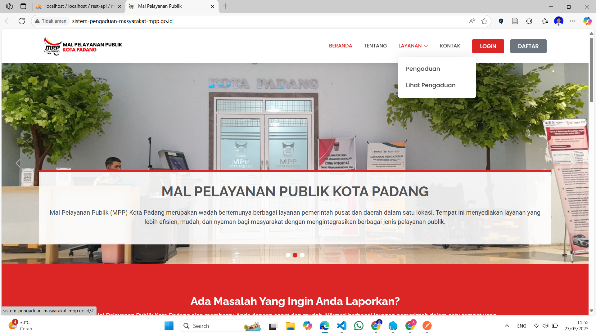
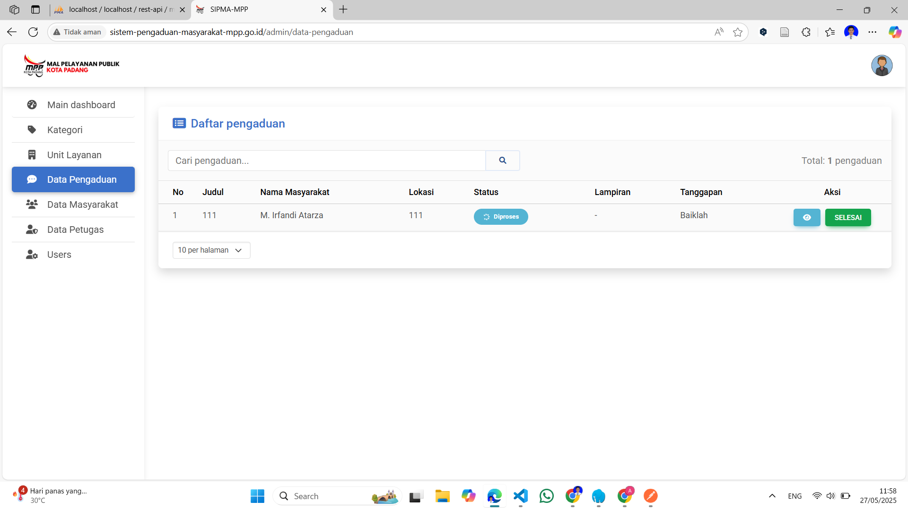
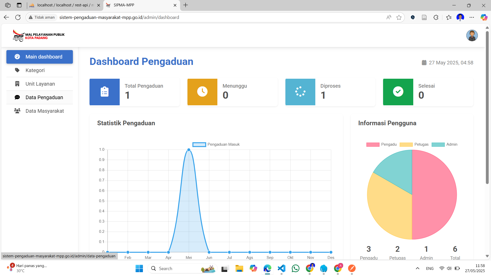

# SIPMA-MPP Kota Padang
## Sistem Informasi Pengaduan Masyarakat Mal Pelayanan Publik


### 📋 Deskripsi Proyek

SIPMA-MPP (Sistem Informasi Pengaduan Masyarakat Mal Pelayanan Publik) Kota Padang adalah aplikasi web berbasis Laravel yang dirancang untuk memfasilitasi pengaduan masyarakat terkait pelayanan publik di Kota Padang. Sistem ini memungkinkan masyarakat untuk menyampaikan keluhan, saran, dan pengaduan secara online dengan sistem yang terstruktur dan dapat dimonitor secara real-time.

### 🎯 Tujuan Sistem

- Meningkatkan transparansi pelayanan publik
- Memudahkan masyarakat dalam menyampaikan pengaduan
- Mempercepat proses penanganan pengaduan
- Memberikan laporan dan statistik pengaduan yang akurat
- Meningkatkan kualitas pelayanan publik di Kota Padang

### 👥 User Roles

#### 1. **Masyarakat**
- Membuat pengaduan baru
- Melihat status pengaduan yang telah dibuat
- Memberikan feedback terhadap penanganan pengaduan

#### 2. **Petugas**
- Dashboard monitoring pengaduan
- Mengelola data unit layanan
- Mengelola data kategori pengaduan
- Memproses dan merespon pengaduan masyarakat
- Mengelola data masyarakat

#### 3. **Admin**
- Dashboard lengkap sistem
- Mengelola semua data master (unit layanan, kategori)
- Mengelola data pengaduan
- Mengelola data masyarakat
- Mengelola data user (petugas dan admin)
- Menghasilkan laporan dan statistik

### 🖼️ Screenshots Sistem

#### Form Pengaduan Masyarakat


#### Dashboard Admin


#### Daftar Pengaduan


#### Dashboard Petugas


### 🛠️ Teknologi yang Digunakan

- **Framework**: Laravel 10.x
- **Database**: MySQL
- **Frontend**: Blade Template, Bootstrap 5
- **Authentication**: Laravel UI
- **File Storage**: Laravel Storage

### 📦 Fitur Utama

#### Untuk Masyarakat:
- ✅ Registrasi dan login
- ✅ Buat pengaduan baru dengan upload file pendukung
- ✅ Lihat riwayat pengaduan
- ✅ Tracking status pengaduan
- ✅ Berikan rating dan feedback

#### Untuk Petugas:
- 📊 Dashboard statistik pengaduan
- 📋 Kelola data unit layanan
- 🏷️ Kelola kategori pengaduan
- 📝 Proses pengaduan (terima, proses, selesai)
- 👥 Lihat data masyarakat
- 📄 Cetak laporan pengaduan

#### Untuk Admin:
- 🎛️ Dashboard lengkap dengan analytics
- 👤 Manajemen user (CRUD petugas dan admin)
- 🏢 Manajemen unit layanan
- 📂 Manajemen kategori pengaduan
- 📊 Laporan statistik komprehensif
- ⚙️ Pengaturan sistem

### ⚙️ Persyaratan Sistem

- PHP >= 8.1
- Composer
- MySQL >= 5.7
- Node.js & NPM (untuk asset compilation)
- Apache/Nginx web server

### 🚀 Instalasi

#### 1. Clone Repository
```bash
git clone https://github.com/your-username/sipma-mpp-padang.git
cd sipma-mpp-padang
```

#### 2. Install Dependencies
```bash
composer install
npm install
```

#### 3. Environment Setup
```bash
cp .env.example .env
php artisan key:generate
```

#### 4. Database Configuration
Edit file `.env` dan sesuaikan konfigurasi database:
```env
DB_CONNECTION=mysql
DB_HOST=127.0.0.1
DB_PORT=3306
DB_DATABASE=sipma_mpp_db
DB_USERNAME=your_username
DB_PASSWORD=your_password
```

#### 5. Database Migration & Seeding
```bash
php artisan migrate
php artisan db:seed
```

#### 6. Storage Link
```bash
php artisan storage:link
```

#### 7. Compile Assets
```bash
npm run dev
# atau untuk production
npm run build
```

#### 8. Jalankan Server
```bash
php artisan serve
```

Aplikasi akan berjalan di `http://localhost:8000`


#### Masyarakat
- Registrasi mandiri melalui halaman pendaftaran


### 🎨 Customization

Untuk menyesuaikan tampilan:
1. Edit file Blade template di `resources/views/`
2. Modifikasi CSS di `resources/css/`
3. Sesuaikan JavaScript di `resources/js/`
4. Compile ulang assets dengan `npm run dev`

### 🐛 Testing

Jalankan test suite:
```bash
php artisan test
```

### 📄 Lisensi

Proyek ini dilisensikan di bawah [MIT License](LICENSE).

### 👨‍💻 Developer

**Tim Pengembang SIPMA-MPP Kota Padang**
- Lead Developer: [Nama Developer]
- Backend Developer: [Nama Developer]
- Frontend Developer: [Nama Developer]
- UI/UX Designer: [Nama Designer]

### 📞 Kontak & Support

- **Email**: support@sipma-mpp.padang.go.id
- **Website**: https://sipma-mpp.padang.go.id
- **Phone**: +62 751 123456
- **Address**: Jl. Bagindo Aziz Chan No. 1, Padang, Sumatera Barat

### 🔄 Changelog

#### Version 1.0.0 (2024-01-15)
- Initial release
- Basic complaint management system
- User role management
- Dashboard analytics

#### Version 1.1.0 (2024-02-01)
- Added file attachment feature
- Enhanced notification system
- Improved mobile responsiveness

### 🚧 Roadmap

- [ ] Mobile application (Android/iOS)
- [ ] WhatsApp integration untuk notifikasi
- [ ] Geolocation untuk pengaduan berbasis lokasi
- [ ] Machine learning untuk kategorisasi otomatis
- [ ] Integration dengan sistem pelayanan publik lainnya

---

## Panduan Penggunaan Cepat

### Untuk Masyarakat:
1. Daftar akun di halaman registrasi
2. Login ke sistem
3. Klik "Buat Pengaduan Baru"
4. Isi form pengaduan dengan lengkap
5. Upload file pendukung jika ada
6. Submit pengaduan
7. Pantau status pengaduan di dashboard

### Untuk Petugas:
1. Login dengan akun petugas
2. Lihat daftar pengaduan yang masuk
3. Klik pengaduan untuk melihat detail
4. Proses pengaduan (ubah status, berikan respon)
5. Update progress penanganan
6. Tandai pengaduan sebagai selesai

### Untuk Admin:
1. Akses dashboard admin
2. Kelola data master (unit layanan, kategori)
3. Monitor semua pengaduan
4. Kelola user petugas
5. Generate laporan statistik
6. Konfigurasi pengaturan sistem

---

*README ini akan terus diperbarui seiring perkembangan sistem. Untuk informasi terbaru, silakan kunjungi repository atau hubungi tim pengembang.*

## License

The Laravel framework is open-sourced software licensed under the [MIT license](https://opensource.org/licenses/MIT).
